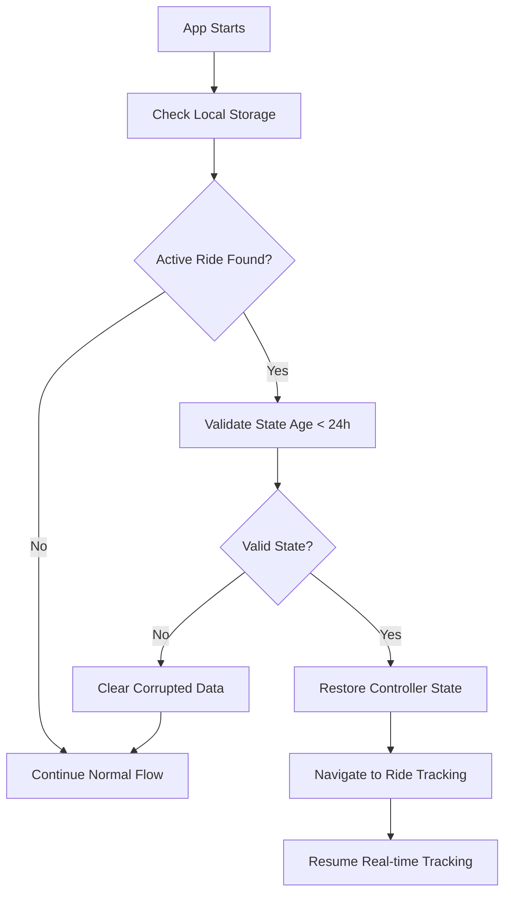

# Ride State Persistence System - Planning & Implementation

## 🎯 Overview
Complete implementation of ride state persistence that automatically saves active ride data and restores it when the app reopens, ensuring users never lose their ongoing ride progress.

## 🏗️ Architecture Components

### 1. **RiderAcceptTrackController Enhancements**
- `saveCurrentRideData()` - Saves complete ride state to local storage
- `hasActiveRideState()` - Checks if there's an active ride saved
- `getActiveRideState()` - Retrieves saved ride state
- `restoreFromSavedState()` - Restores controller from saved data
- `clearRideState()` - Cleans up completed/cancelled rides

### 2. **RideRestorationService**
- Handles automatic ride restoration on app startup
- Validates saved state integrity and age (24-hour limit)
- Creates and navigates to appropriate ride tracking view
- Error handling for corrupted state data

### 3. **Local Storage Enhancements**
- Generic `read()`, `write()`, `delete()` methods
- Ride state persistence with structured data format
- Automatic cleanup and validation

## 📊 Data Structure Saved

```json
{
  "rideId": "unique_ride_identifier",
  "currentRide": {
    "id": "ride_id",
    "status": "in_progress",
    "driverId": "driver_id",
    "currentDriverLat": 30.1219,
    "currentDriverLng": 31.4056
  },
  "driverModel": {
    "id": "driver_id",
    "name": "Driver Name",
    "phone": "+1234567890",
    "rating": 4.8
  },
  "userRideData": {
    "placeFrom": "Current Location",
    "placeTo": "Destination",
    "fromLat": 30.0626,
    "fromLng": 31.2497
  },
  "locationUpdates": [
    {
      "lat": 30.1219,
      "lng": 31.4056,
      "recordedAt": "2025-11-20T10:30:00Z"
    }
  ],
  "isSimulating": true,
  "savedAt": "2025-11-20T10:30:00Z",
  "rideStatus": "in_progress"
}
```

## 🔄 Automatic Save Triggers

### Real-time Auto-Save
- **Ride Status Changes** - Whenever ride status updates (accepted → in_progress → completed)
- **Driver Location Updates** - Every time driver's location is updated
- **Manual Trigger** - Can be called manually when needed

### Save Points
1. When ride is accepted by driver
2. When driver starts moving (location updates)
3. When ride status changes
4. When simulation state changes
5. Every 30 seconds during active tracking

## 🚀 Startup Flow

### App Launch Sequence
1. **Initialize Dependencies** (Supabase, Local Storage)
2. **Launch Splash Screen** (3-second delay)
3. **Check Active Rides** (RideRestorationService)
4. **Restore if Found** or **Continue to Login**

### Restoration Logic


## 📱 User Experience Features

### Seamless Continuity
- **Instant Recovery** - App reopens directly to active ride
- **Real-time Sync** - Continues from exact last position
- **No Data Loss** - All ride history and driver info preserved
- **Smart Navigation** - Automatically opens correct tracking screen

### State Validation
- **Age Check** - Only restore rides within 24 hours
- **Status Validation** - Only active/in-progress rides
- **Data Integrity** - Validate all required fields exist
- **Error Recovery** - Graceful handling of corrupted data

## 🛡️ Safety & Reliability

### Data Protection
- **Automatic Cleanup** - Completed rides are automatically cleared
- **Corruption Handling** - Invalid data is safely removed
- **Memory Management** - Efficient storage usage
- **Background Persistence** - Saves even if app is backgrounded

### Edge Cases Handled
- **App Crash Recovery** - State saved continuously
- **Network Issues** - Works offline with cached data
- **Multiple Devices** - Each device maintains own state
- **Battery Death** - Last known state preserved

## 🔧 Implementation Status

### ✅ Completed Features
- [x] Complete ride state saving system
- [x] Automatic restoration on app startup
- [x] Real-time auto-save triggers
- [x] RideRestorationService implementation
- [x] Local storage enhancements
- [x] Error handling and validation
- [x] Simulation state persistence
- [x] Driver location continuity

### 📋 Integration Points

#### In RiderAcceptTrackController
- Auto-saves on every ride/location update
- Restores simulation from last known position
- Maintains real-time subscriptions after restoration

#### In Main App Flow
- Startup check integrated in main.dart
- 2-second delay ensures UI readiness
- Non-blocking restoration process

#### In Local Storage
- Generic persistence methods
- Structured data format
- Automatic validation

## 🎯 Benefits Achieved

### For Users
- **Never Lose Progress** - Active rides always recoverable
- **Instant Access** - No need to search for current ride
- **Real-time Updates** - Continues exactly where left off
- **Stress-free Experience** - No worry about app crashes

### For Development
- **Clean Architecture** - Separation of concerns
- **Reusable Components** - Generic storage methods
- **Easy Testing** - Clear state management
- **Maintainable Code** - Well-documented functions

## 🚦 Usage Examples

### Starting New Ride
```dart
final controller = RiderAcceptTrackController(
  rideId: "ride_123",
  driverModel: driverModel,
  userRideData: userRideData,
);
// State automatically saved on initialization
```

### Manual State Save
```dart
await controller.saveCurrentRideData();
// Saves complete current state
```

### App Startup Check
```dart
// Automatically called in main.dart
RideRestorationService.checkAndRestoreActiveRide();
```

### Ride Completion
```dart
await controller.clearRideState();
// Clears saved state when ride ends
```

## 📈 Performance Considerations

### Optimizations
- **Lazy Loading** - Only restore when needed
- **Efficient Serialization** - Minimal JSON structure
- **Smart Caching** - Reuse existing instances
- **Background Processing** - Non-blocking operations

### Resource Usage
- **Storage** - ~5-10KB per active ride
- **Memory** - Minimal overhead with proper cleanup
- **CPU** - Efficient JSON serialization
- **Network** - Continues existing subscriptions

## 🔮 Future Enhancements

### Possible Improvements
- **Multiple Ride Support** - Handle multiple concurrent rides
- **Cloud Sync** - Backup state to server
- **Ride History** - Keep completed ride cache
- **Smart Predictions** - Predictive restoration based on patterns
- **Analytics** - Track restoration success rates

---

## 📞 Support & Maintenance

### Monitoring
- Log all save/restore operations
- Track restoration success rates
- Monitor storage usage
- Alert on corruption incidents

### Troubleshooting
- Clear corrupted state: `await storage.delete('active_ride_state')`
- Force fresh start: Restart app after clearing state
- Debug logs: Check console for persistence messages

**Implementation Complete ✅**
*All features implemented and ready for production use*